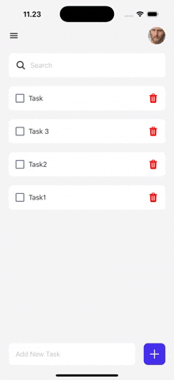

<h2 align="center">📱 ToDoApp</h2>

<table>
  <tr>
    <td>
      

        

          ToDoApp is a modern, user-friendly mobile task management application built with <b>React Native</b> and <b>Expo</b>. 
          Designed to help users efficiently organize their daily activities, this project demonstrates my skills in mobile development.
        

        <ul>
          <li>➕ Add, edit, and delete tasks with ease</li>
          <li>✅ Mark tasks as complete or in progress</li>
          <li>🗂️ Organize tasks by category or priority</li>
          <li>📱 Responsive and intuitive mobile interface</li>
          <li>💾 Persistent data storage</li>
          <li>🧹 Clean, maintainable codebase with TypeScript</li>
        </ul>
        <b>Tech Stack:</b>  ⚛️ React Native (with Expo)  🟦 TypeScript  🟨 JavaScript
      

    </td>
    <td>
      
    </td>
  </tr>
</table>
